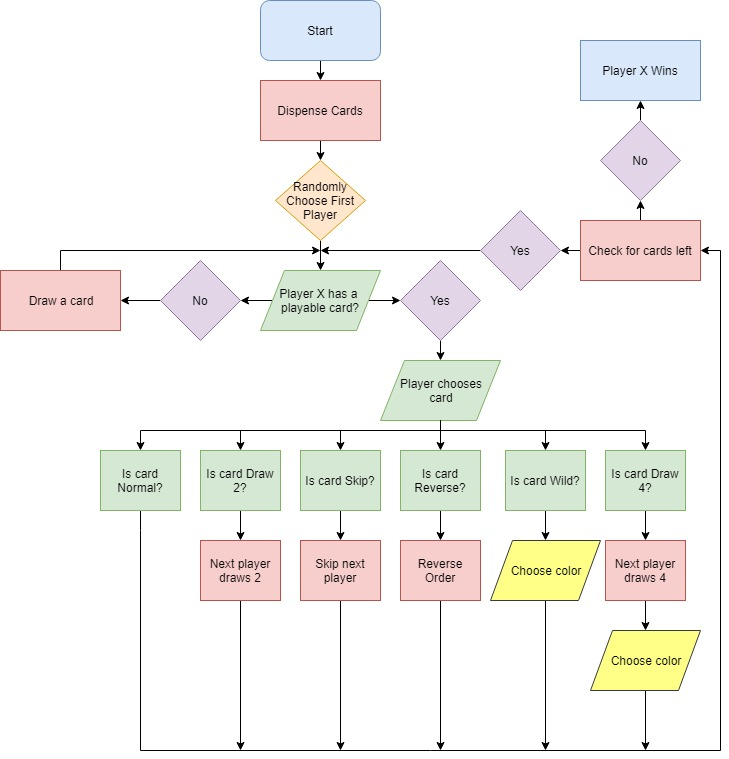

# UnoGame

## Tabel of Contents

- Rules
- Gameplay
- Draw.io Flowchart
- YouTube Video

## Rules
- In the beginning of the game everyone gets 7 cards. Then a card is drawn from the top of the deck and placed for the first player to play off of. The first player to go is random. A card can only be played if the card on the table is the same color unless the card wanting to be played is a wild. If it is a wild card it can be placed at any time and the player can change the color to whatever they would like. If the player plays a +4 card it works the same as a wild card, except the next player draws four cards as well. There are also skips, +2's, and reverses. Skips skip the next player, +2's give the next player 2 cards, and reverses change the direction the players in play. If the player gets down to zero cards, they win the match. 

## Gameplay
- The game begins with a randomly selected first player. The user is automatically assigned the player 4 slot. Turns will be taken in chronological order, until a reverse is played. The user MUST choose the slot number of their card (NOT the card number/color) for the code to continue. Failure to do so may result in unexpected card choices. Any wild or +4 card played by the computer will randomly generate a color to use. If the user plays either of these cards, they must manually choose one of the colors by entering a number between 1 and 4. By selecting 0 as a card choice, you will draw a card. This can be done as a strategy, or if one does not have any playable cards in hand. Once one player reaches zero cards, that player wins. Good luck!

## Flowchart

## Youtube
<a href ="https://www.youtube.com/watch?v=NFCbYbj8N3M&feature=youtu.be">My video is here</a>
